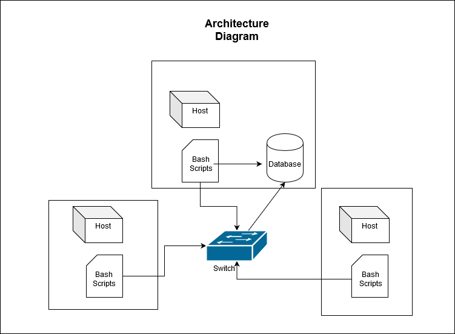

# Linux Cluster Monitoring Agent

## Introduction

Cluster Monitor Agent is an internal tool that monitors the cluster resources by tracking diagnostic information. This helps the infrastructure team to record the hardware specifications of each node and monitor node resource usages (e.g. CPU/Memory). This is all done through the use of Docker along with a PostgreSQL database which is hosted on one of the nodes. The database is then updated with the use of bash agents from each node.

## Architecture and Design


Based on the image above, bash scripts are run from each node. These scripts collect real time resource usage along with hardware specifications and is sent to the PostgreSQL Database. This is done with the use of a switch.

### Database Description

The PostgreSQL Database, `host_data`, is made up of two tables: `host_info`, which is for recording hardware specifications for each node and `host_usage` which is for recording resource usage for each node.

The `host_info` table is only added once during startup by each node as hardware specifications are not expected to be modified regularly. The following data is collected into the `host_info` table:

* `id`: id number pertaining to each node. This is auto-incremented by PostgreSQL
* `hostname`: hostname of the node.
* `cpu_number`: Number of cores in CPU
* `cpu_architecture`: x32 or x64 CPU architecture
* `cpu_model`: Make and Model of CPU
* `cpu_mhz`: CPU speed
* `L2_cache`: L2 cache size (kB)
* `total_mem`: Total Memory in System (kB)
* `timestamp`: UTC timestamp of when specifications were collected by node

The `host_usage` table is only is added every minute by each node. This is to monitor usage over time. The following data is collectied into the `host_usage` table:

* `timestamp`: UTC timestamp of when specifications were collected by node
* `host_id`: `id` in `host_info` table
* `mem_free`: Amount of unused memory (MB)
* `cpu_idle`: Percent to CPU time spent idle
* `cpu_kernel`: Percent of CPU time spent running kernel/system code
* `disk_io`: Number of disk I/O operations currently running  
* `disk_available`: Amount of idle diskspace (MB)

### Scripts Decription

* `host_info.sh` - collects host hardware info once and stores into `host_info` table
* `host_usage.sh` - collects host usage info every minute and stores into `host_usage` table
* `psql_docker.sh` - used to start,stop and create Docker PostgreSQL container.
* `ddl.sql` - automates creation of `host_agent` PostgreSQL database and creates `host_info` and `host_usage` tables.
* `queries.sql` - Contains two queries to manage the cluster for future referencees. These are grouping nodes by the number of CPUs and total memory and calculating and outputting the average memory usage over a 5 minute interval per node


## Usage
### Database and Tables Initialization
Once a PostgreSQL instance has been created, the Docker container needs to be started using `psql_docker.sh`.`ddl.sql` is then run to initialize the database along with the two tables.
```bash
# Provision and start a PostgreSQL instance with docker
./linux_sql/scripts/psql_docker.sh start

# Initalize database and two tables
psql -h psql_host -U psql_user -W -f linux_sql/sql/ddl.sql
```
### `host_info.sh` Usage
This script will only be run once per node to store hardware specs into the `host_info` table.
```bash
#Insert hardware specs of node into `host_info` table
./linux_sql/scripts/host_info.sh psql_host psql_port db_name psql_user psql_password
```
### `host_usage.sh` Usage
This script inserts the current resource usage from each note into the `host_usage` table. To have this script run automatically, please see crontab setup below.
```bash
#Insert resource usage into `host_usage` table
./linux_sql/scripts/host_usage.sh psql_host psql_port db_name psql_user psql_password
```
### Crontab Setup
Crontab allows the `host_usage.sh` script to be run at a certain interval. The current setup runs every minute. This can be changed by modifying `* * * * *` portion of code below

```bash
# Edit Crontab jobs
crontab -e

#Setup Crontab job
* * * * * bash [path]/host_usage.sh psql_host psql_port db_name psql_user psql_password > /tmp/host_usage.sh

# Verify Crontab job has started
crontab -ls
```

## Improvements


1) Handle Hardware Updates - Whenever new updates are made to the hardware from the node, a 'host_info' script can be modified to update the database 'host_info' table
3) Backups - Backups can be created on all nodes in case the database fails.
2) Optimize Resource Usage - If a particular node usage is high, this could require better allocation of resources or require a hardware upgrade if necessary
